# UniversalApp
> Application eshop partly based on ridelectric structure,
> however definitely more develop. 

## Table of contents
* [General info](#general-info)
* [Technologies](#technologies)
* [Instruction](#instructions)
* [Live View](#live-view)
* [Status](#status)
* [Contact](#contact)

## General info
> SuperUser have possibility to
> modify details of Owner - like : logo, company data, colors of
> templates elements and so on. 

## Technologies
* Python - version 3.8
* Python Django - version 3.0.6
* Django REST Framework
* HTML/CSS/Bootstrap
* JavaScript 
* MySQL

## Instructions
#### In admin panel you can change elements dynamically
#### (like: logo, images, background of home/about page, images othree photos on front, fonts and other):
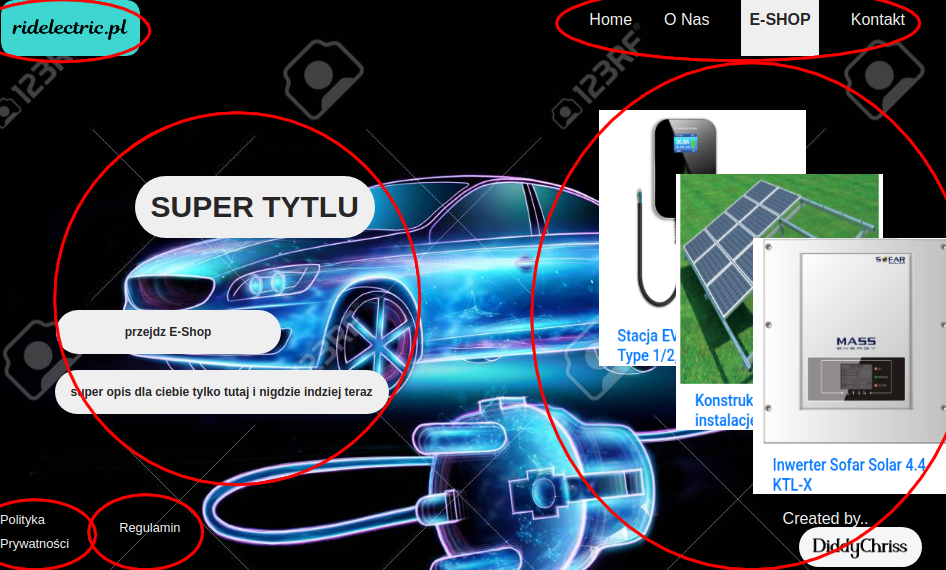
#### admin panel edit
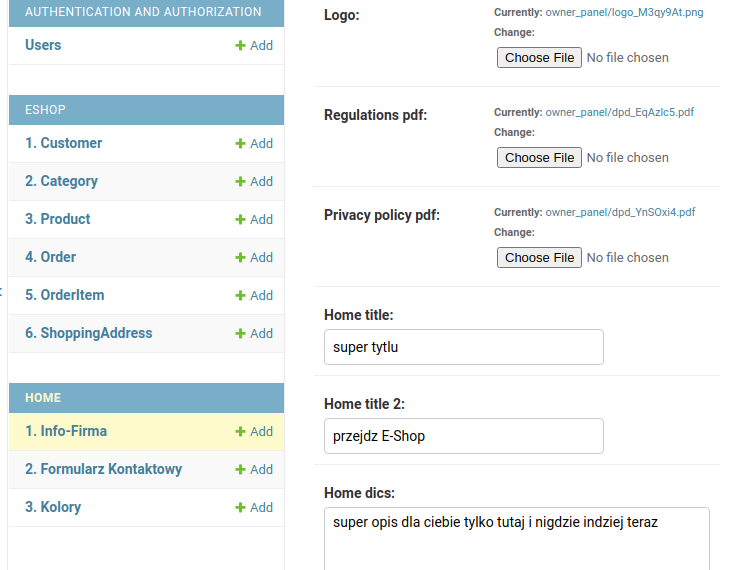

#### This same thing with aboute page..
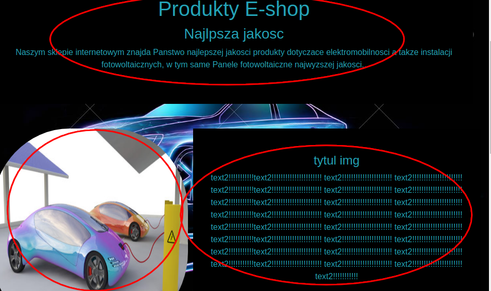
#### admin panel edit
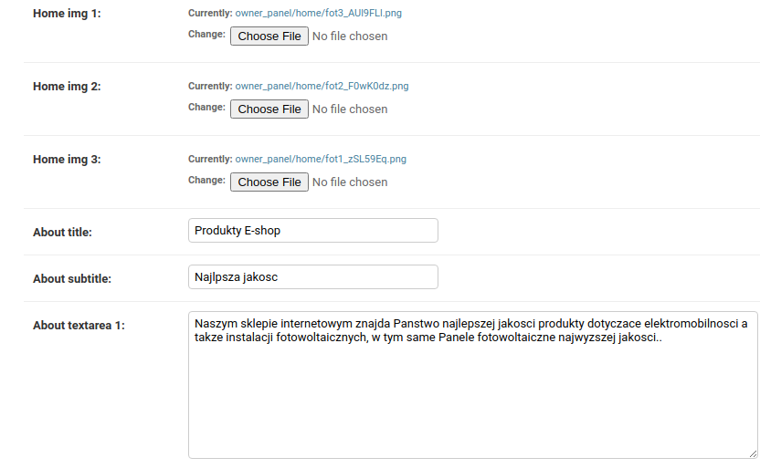

#### Also in shop..
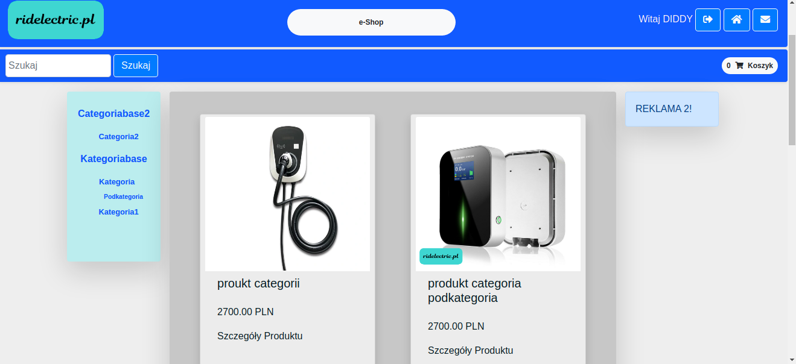

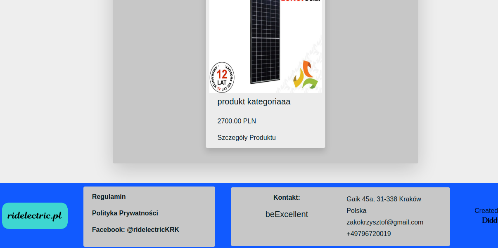

#### admin panel edit..
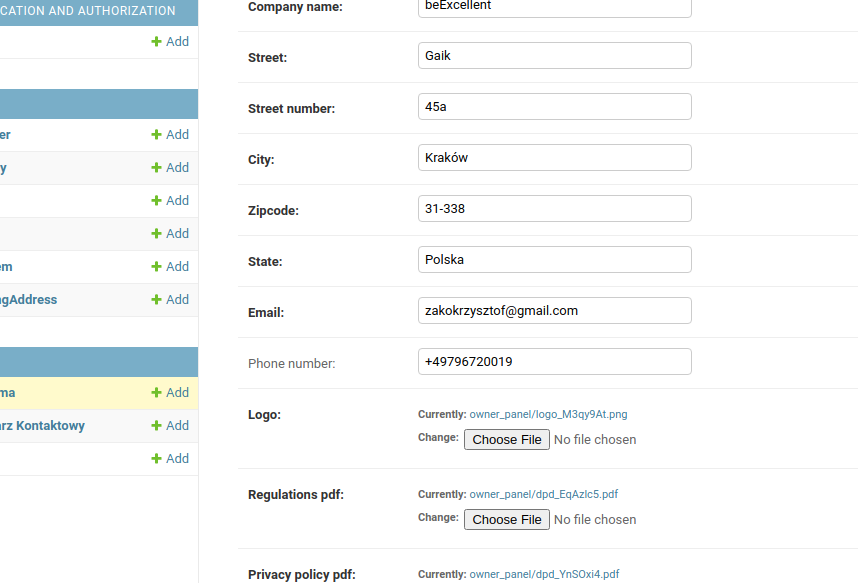

#### Create category..
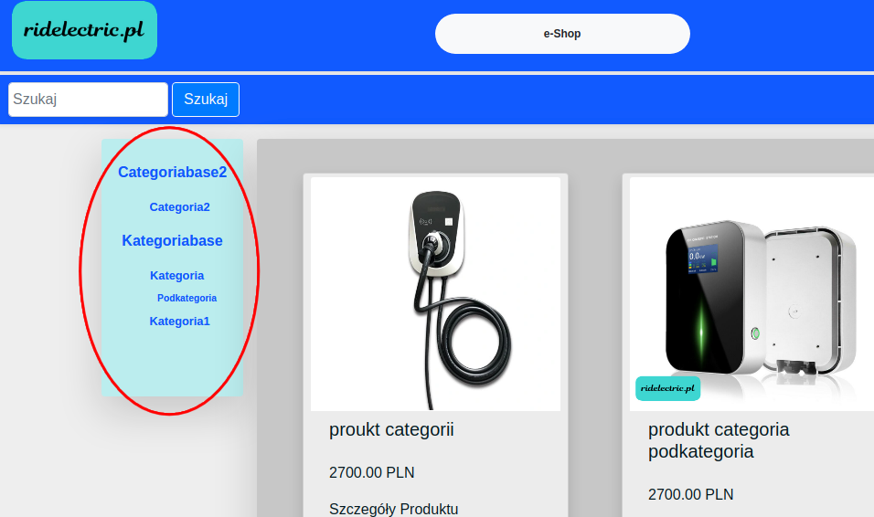

#### in admin panel..
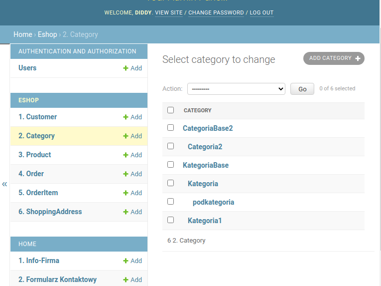

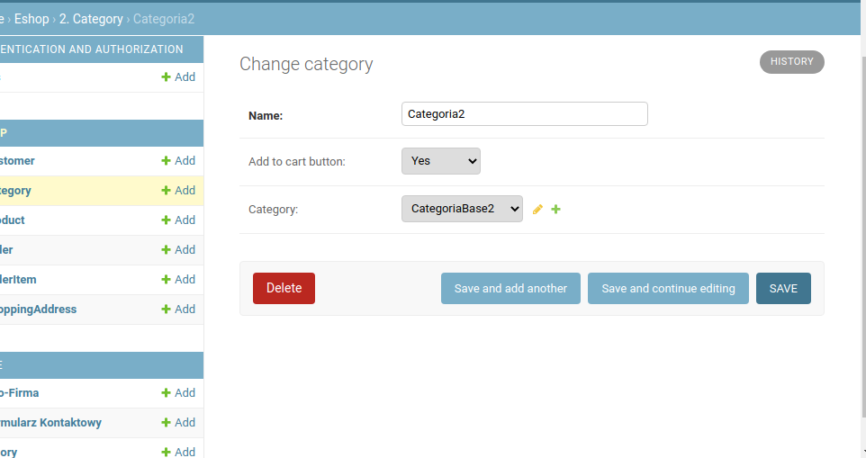

#### Add some product and select category..
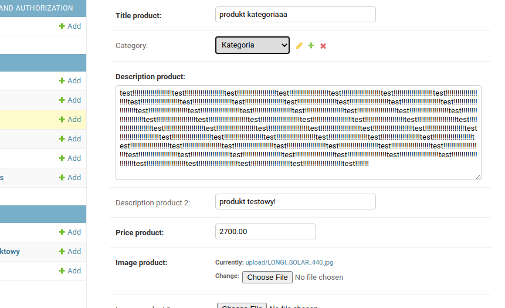

#### Change colors of fonts
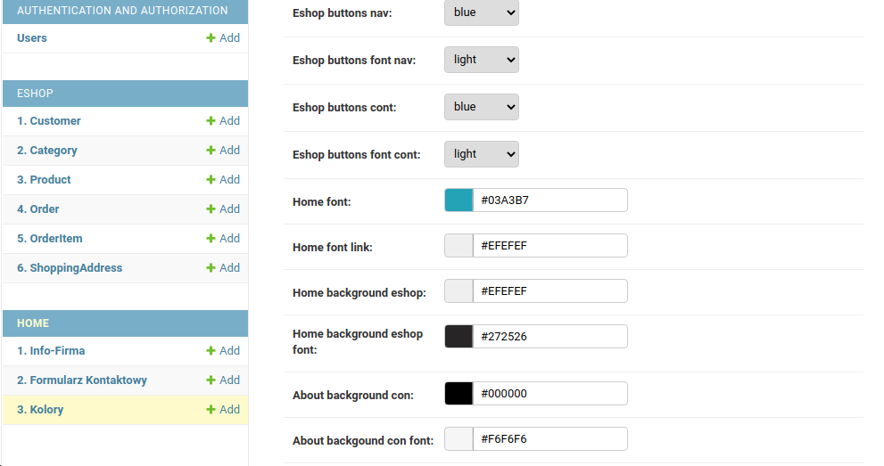

#### Register as user, and login..
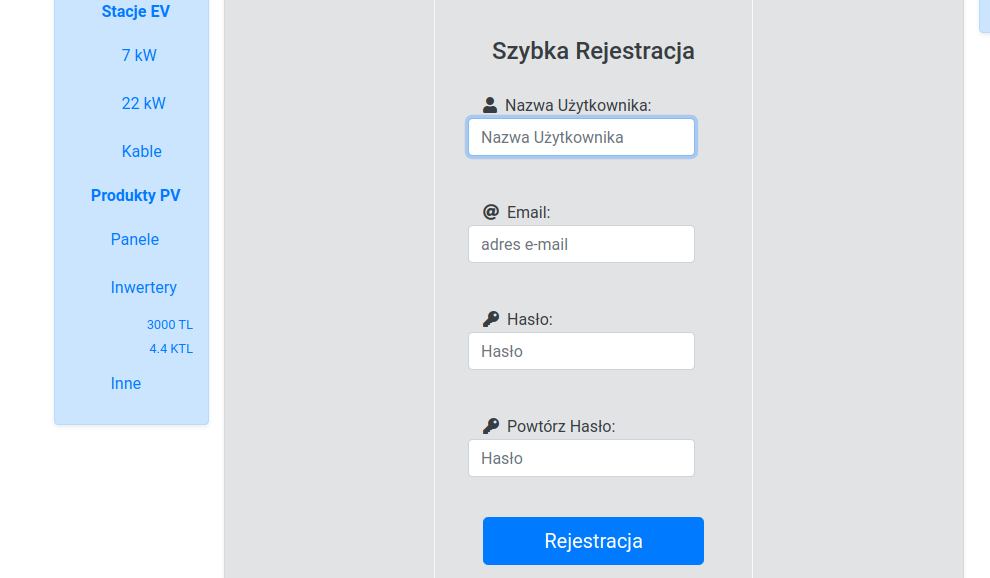

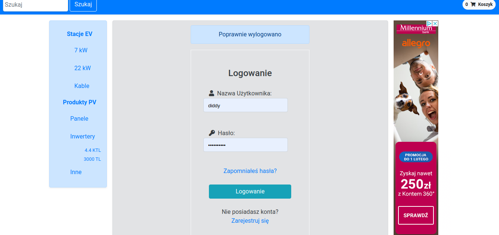

#### Add products to Cart and go to payment..

#### Check API user..

#### Detail API - user info..
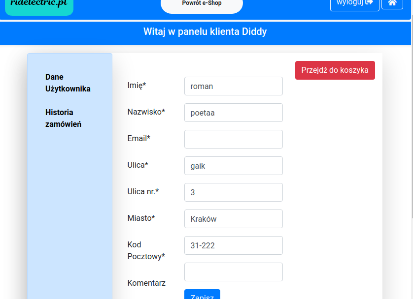

#### Detail API - order history..
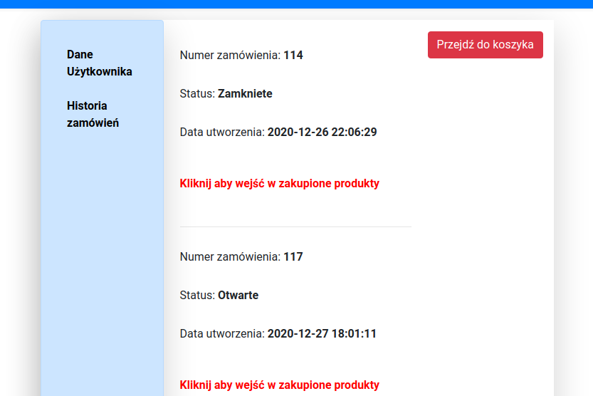

#### Contact form in contact page..
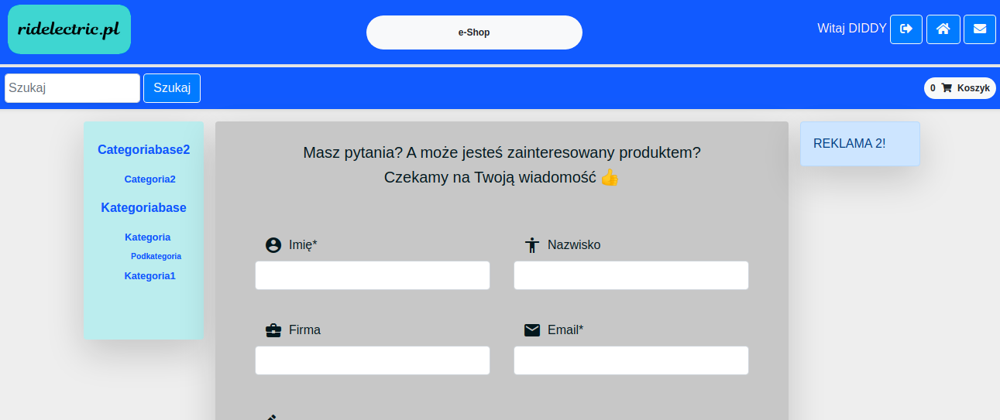

#### Only the element's shemat (position) remains unchanged
#### the rest depends on your configuration

## Live View
Live view available on (www.diddychriss.online.pl/) 

## Status
In progress

## Contact
Created by [DiddyChriss] (http://chriss.pythonanywhere.com/) - feel free to contact me!
